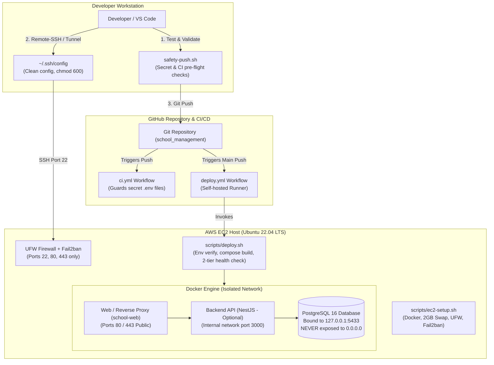

# EC2 Deployment & Infrastructure Hardening Runbook

This runbook documents the complete architecture, security hardening standards, host provisioning, and deployment procedures for the **School Management System (Chea Chanto College)** on AWS EC2.

---

## 1. Architectural Overview & Workflow



---

## 2. Core Security Standards

The project strictly complies with 4 production security standards:

### A. Secret Protection in Git & CI

1. **`.gitignore` Rules**:
   ```gitignore
   # Block all .env files except designated safe templates
   .env*
   !.env.example
   ```
2. **CI Pipeline Guard (`.github/workflows/ci.yml`)**:
   Blocks any pull request or push containing tracked environment secrets:
   ```yaml
   - name: Block tracked secret files
     run: |
       set -euo pipefail
       tracked="$(git ls-files '.env' '.env.*' ':!:.env.example' || true)"
       if [ -n "$tracked" ]; then
         echo "Tracked environment files are not allowed:"
         echo "$tracked"
         exit 1
       fi
   ```
3. **Local Pre-push Guard (`./safety-push.sh`)**:
   Validates both tracked and staged files on developer machines prior to pushing.

### B. Zero Database Exposure (Docker Port Hardening)

Docker by default inserts `iptables` rules that bypass UFW when ports are published. Database ports must **never** be mapped to `0.0.0.0`.

In `docker-compose.yml`:

```yaml
services:
  postgres:
    image: postgres:16-alpine
    ports:
      # SAFE: Binds exclusively to host loopback interface
      - "${POSTGRES_PORT_BINDING:-127.0.0.1:5433}:5432"
```

### C. OS-Level Defense (`scripts/ec2-setup.sh`)

- **2GB Swapfile**: Allocated automatically if host RAM < 4GB, preventing Out-Of-Memory (OOM) killer terminations during `docker compose build`.
- **UFW Firewall**: Default policy denies all incoming traffic; strictly allows:
  - `22/tcp` (SSH)
  - `80/tcp` (HTTP)
  - `443/tcp` (HTTPS)
- **Fail2ban**: Intercepts SSH brute-force attacks via systemd journal and bans offending IPs for 1 hour after 5 failed attempts within 10 minutes.

### D. Zero-Downtime Deployment & Verification (`scripts/deploy.sh`)

1. Enforces `chmod 600 .env` file permissions.
2. Validates Docker Compose file syntax (`docker compose config -q`).
3. Executes zero-orphan rebuild (`docker compose up -d --build --remove-orphans`).
4. Runs automated 2-tier health verification:
   - **Tier 1 (Database)**: Tests PostgreSQL connection via `pg_isready`.
   - **Tier 2 (Web Server)**: Probes HTTP/HTTPS response codes (`200`, `301`, `302`) via `curl`.
5. Automatically prunes dangling images to prevent disk exhaustion.

---

## 3. Server Specifications & AWS Provisioning

### Instance Recommendations

- **Instance Type**: `t3.small` (2 vCPU, 2GB RAM) minimum; `t3.medium` (2 vCPU, 4GB RAM) recommended for production.
- **Operating System**: Ubuntu 22.04 LTS (Jammy Jellyfish) 64-bit (x86_64 or arm64).
- **Storage**: 20GB – 40GB gp3 EBS Volume.
- **Elastic IP**: Allocate a static AWS Elastic IP and associate it with the EC2 instance.

### AWS Security Group Configuration

Configure the EC2 instance Security Group with minimal necessary ports:

| Type         | Protocol | Port Range | Source                                        | Description                  |
| :----------- | :------- | :--------- | :-------------------------------------------- | :--------------------------- |
| **Inbound**  | TCP      | 22         | Admin / Office CIDR (or 0.0.0.0/0 if dynamic) | Secure SSH access            |
| **Inbound**  | TCP      | 80         | 0.0.0.0/0, ::/0                               | HTTP (Redirect to HTTPS)     |
| **Inbound**  | TCP      | 443        | 0.0.0.0/0, ::/0                               | HTTPS Web Traffic            |
| **Outbound** | All      | All        | 0.0.0.0/0, ::/0                               | Outbound updates / API calls |

---

## 4. Step-by-Step Server Setup Runbook

### Step 1: Connect to Fresh EC2 Host

```bash
ssh -i ~/.ssh/your-key.pem ubuntu@<EC2_ELASTIC_IP>
```

### Step 2: Clone Repository

```bash
git clone https://github.com/bora168-coder/school_management.git ~/school_management
cd ~/school_management
```

### Step 3: Run Host Provisioning Script

Run the automated host hardening and software installation script:

```bash
sudo ./scripts/ec2-setup.sh
```

After the script completes, activate the Docker group membership for the current shell:

```bash
newgrp docker
```

### Step 4: Configure Production Environment Variables

Create the production `.env` file from the template and enforce restrictive permissions:

```bash
cp .env.example .env
chmod 600 .env
nano .env
```

Ensure you update:

- `POSTGRES_USER` and `POSTGRES_PASSWORD` (use strong passwords)
- `JWT_SECRET` (generate using `openssl rand -hex 32`)
- `TLS_CERT_PATH` and `TLS_KEY_PATH`

### Step 5: Execute First Deployment

```bash
./scripts/deploy.sh
```

The script will generate fallback TLS certificates (if not already provided), validate Compose syntax, build the containers, and run the 2-tier health check.

---

## 5. Developer Workstation Setup (VS Code Remote-SSH)

To connect securely to the EC2 instance from VS Code:

### A. Update `~/.ssh/config`

Add the following block to `~/.ssh/config` on your local computer (**do not wrap in markdown backticks**):

```sshconfig
Host school-ec2
    HostName <EC2_ELASTIC_IP>
    User ubuntu
    IdentityFile ~/.ssh/your-key.pem
    ServerAliveInterval 60
    ServerAliveCountMax 3
```

### B. Restrict Local Permissions

```bash
chmod 600 ~/.ssh/config ~/.ssh/your-key.pem
```

### C. Connect via VS Code

1. Open VS Code.
2. Press `Ctrl+Shift+P` (or `Cmd+Shift+P` on macOS).
3. Select **Remote-SSH: Connect to Host...** &rarr; `school-ec2`.
4. Open the remote folder: `/home/ubuntu/school_management`.

---

## 6. GitHub Actions Self-Hosted CD Runner Setup

To enable automated zero-touch deployments upon pushing to `main`:

1. In GitHub, navigate to **Settings** &rarr; **Actions** &rarr; **Runners** &rarr; **New self-hosted runner**.
2. Select OS: **Linux**, Architecture: **x64** (or **ARM64** depending on EC2 instance).
3. Follow the GitHub prompts to download and configure the runner under `/home/ubuntu/actions-runner`.
4. Install the runner as a systemd service:
   ```bash
   sudo ./svc.sh install ubuntu
   sudo ./svc.sh start
   ```
5. Ensure repository secrets `TELEGRAM_BOT_TOKEN` and `TELEGRAM_CHAT_ID` are configured for deployment notifications.

Whenever code is pushed to `main`, `.github/workflows/deploy.yml` triggers `./scripts/deploy.sh --skip-pull` automatically.

---

## 7. Operations & Maintenance Playbook

### Checking Container Health and Logs

```bash
# Check service status
docker compose ps

# View live web logs
docker compose logs -f school-web

# View PostgreSQL logs
docker compose logs -f postgres
```

### PostgreSQL Database Backups

Create a point-in-time database backup using Docker exec:

```bash
# Create backups directory
mkdir -p ~/backups

# Dump database to compressed SQL file
docker compose exec -T postgres pg_dump -U school_admin -d school_db | gzip > ~/backups/school_db_$(date +%Y%m%d_%H%M%S).sql.gz

# Restore database from backup
gunzip < ~/backups/school_db_YYYYMMDD_HHMMSS.sql.gz | docker compose exec -T postgres psql -U school_admin -d school_db
```

### Managing Fail2ban

```bash
# Check SSH jail status and currently banned IPs
sudo fail2ban-client status sshd

# Unban an IP address if an admin was locked out
sudo fail2ban-client set sshd unbanip <IP_ADDRESS>
```

### Updating SSL / TLS Certificates

If using Let's Encrypt (Certbot) on the host:

```bash
sudo certbot certonly --standalone -d cheachantocollege.edu.kh
```

Update `.env` to point to the live certificates:

```env
TLS_CERT_PATH=/etc/letsencrypt/live/cheachantocollege.edu.kh/fullchain.pem
TLS_KEY_PATH=/etc/letsencrypt/live/cheachantocollege.edu.kh/privkey.pem
```

Reload Nginx without downtime:

```bash
docker compose exec school-web nginx -s reload
```

---

## 8. Troubleshooting Reference

| Symptom                                            | Probable Cause                                                      | Resolution                                                                                                                      |
| :------------------------------------------------- | :------------------------------------------------------------------ | :------------------------------------------------------------------------------------------------------------------------------ |
| `docker compose build` crashes with exit code 137  | System ran out of memory (OOM killer)                               | Verify swapfile exists: `swapon --show`. If missing, run `sudo ./scripts/ec2-setup.sh` to enable 2GB swap.                      |
| Cannot connect to PostgreSQL from local admin tool | Expected security posture (PostgreSQL is bound to `127.0.0.1:5433`) | Open an SSH tunnel: `ssh -L 5433:127.0.0.1:5433 -i ~/.ssh/your-key.pem ubuntu@<EC2_IP>`. Connect your tool to `localhost:5433`. |
| Health check fails for web tier                    | Container failed to start or TLS cert invalid                       | Run `docker compose logs school-web` to inspect Nginx startup logs.                                                             |
| SSH connection timed out                           | UFW or AWS Security Group blocked port 22                           | Verify Security Group inbound rule allows TCP port 22 from your current IP.                                                     |
| `deploy.sh` fails: `.env permissions not 600`      | Overly permissive file mode                                         | Run `chmod 600 .env` and re-run `./scripts/deploy.sh`.                                                                          |
